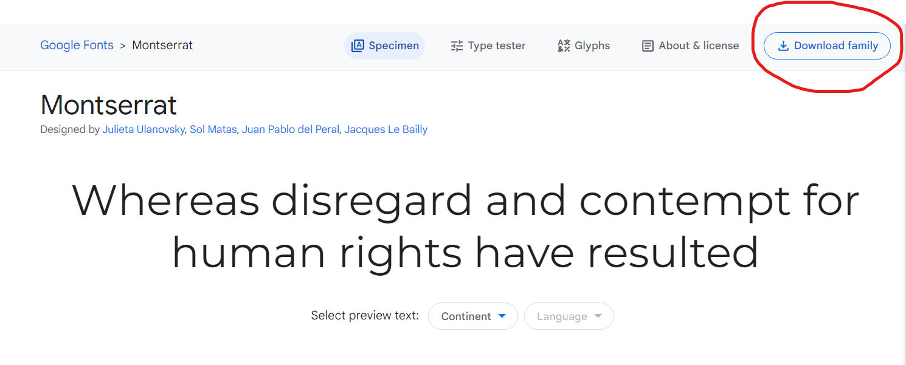
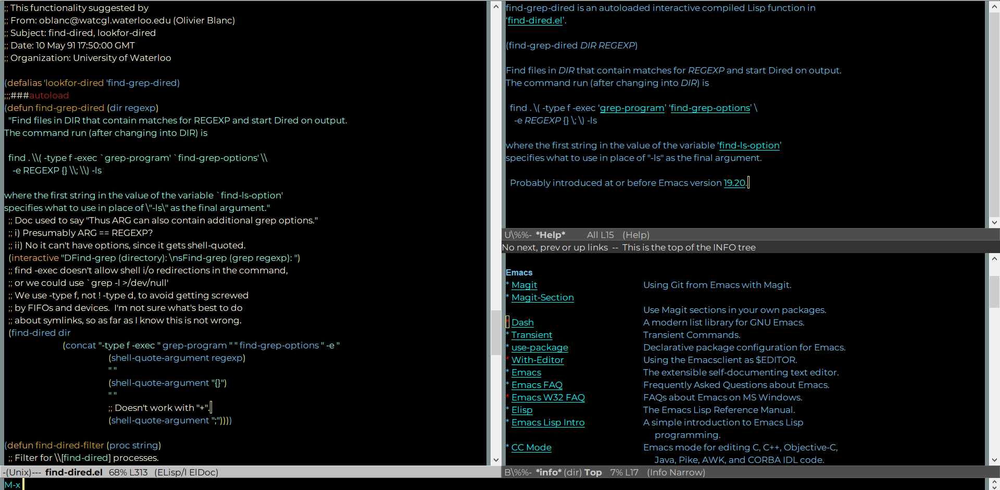

# citrusOcean Theme
custom [Emacs](https://www.gnu.org/software/emacs/) theme - a theme base on blue and orange

## Installation
1. Download the [theme file](./citrusOcean.el) and put it to your emacs.d directory.
2. Download the [Mosterrat font file](https://fonts.google.com/specimen/Montserrat?query=Mon&preview.text=Mo&preview.text_type=custom) and install it.
  
3. Download [ranbow-delimiters package](https://github.com/Fanael/rainbow-delimiters) from [Melpha](https://melpa.org/#/rainbow-delimiters) and enable it.
4. Execute the following commands in your emacs init file.
  ```elisp
  M-x load-theme RET
  ```
  ```elisp
  citrusOcean
  ```
5. If you find that you have to execute the above command every time you start emacs, add the following to your init file.
  ```elisp
  (add-hook 'after-init-hook (lambda () (load-theme 'citrusOcean)))
  ```
## Screenshots


## License
[GPL3 License](./LICENSE)
